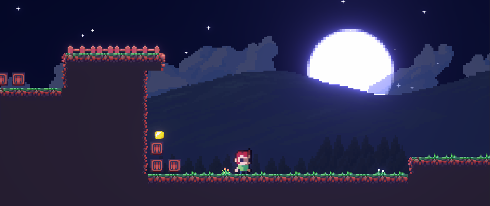
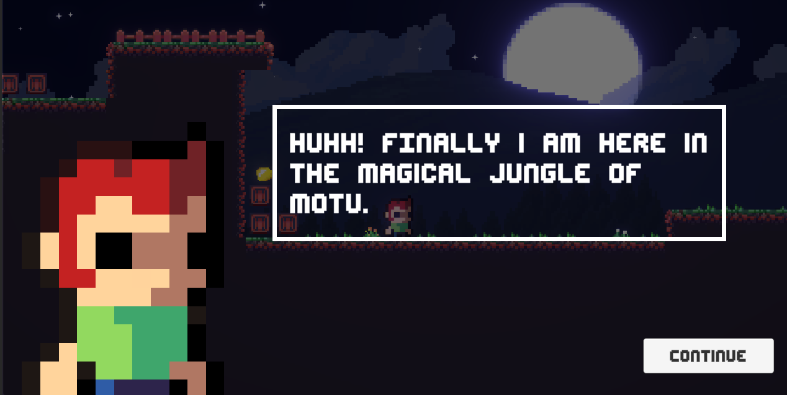
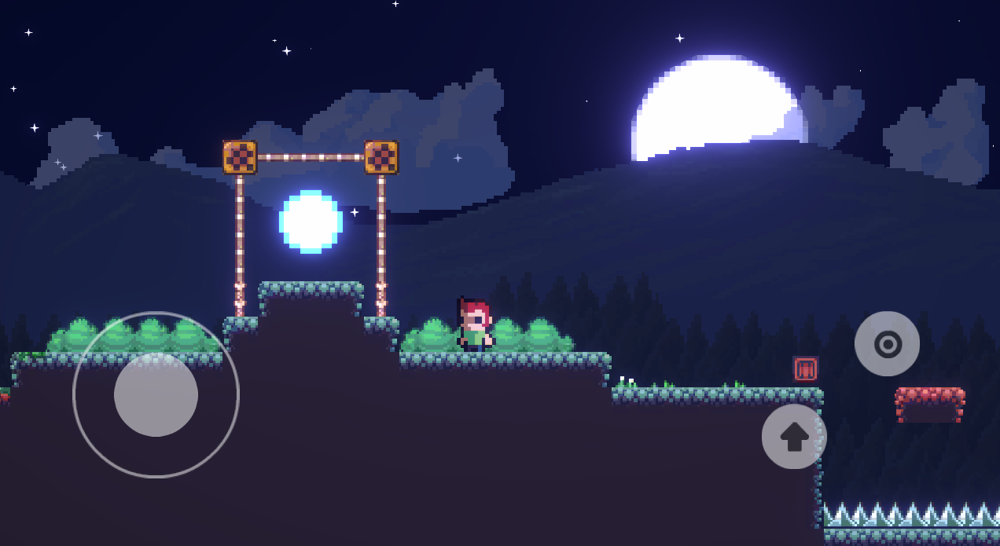
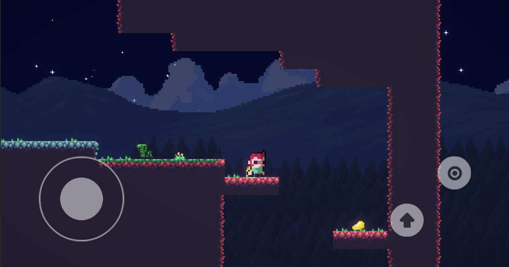

# Blueshade Platformer



Blueshade Platformer is an Android-focused platformer game developed using Unity3D (Unity version 2021.3.16f1).

## Overview

This project aims to create an engaging platformer game for Android devices. It incorporates various features and mechanics typical of classic platformer games, providing an immersive gaming experience.

## Features

- **Engaging Gameplay**: Enjoy a challenging platformer experience with intuitive controls.
- **Level Design**: Explore intricately designed levels with different challenges and obstacles.
- **Character Customization**: Customize characters with various skins and abilities.
- **Mobile Optimization**: Specifically tailored for Android devices, ensuring smooth performance.

## Screenshots





## Getting Started

To get started with Blueshade Platformer, follow these steps:

1. Clone this repository.
    ```
    git clone https://github.com/yourusername/Blueshade-Platformer.git
    ```

2. Open the project in Unity 2021.3.16f1 or a compatible version.

3. Navigate to the main scene `MainScene.unity` and start exploring or modifying the game as needed.

## Contributing

Contributions are welcome! If you'd like to contribute to Blueshade Platformer, please follow these steps:

1. Fork the repository.
2. Create a new branch (`git checkout -b feature/your-feature`).
3. Make your changes.
4. Commit your changes (`git commit -m 'Add your feature'`).
5. Push to the branch (`git push origin feature/your-feature`).
6. Create a pull request.


## Contact

For any inquiries or suggestions, feel free to reach out to [your email or contact information].

Enjoy playing Blueshade Platformer!

---